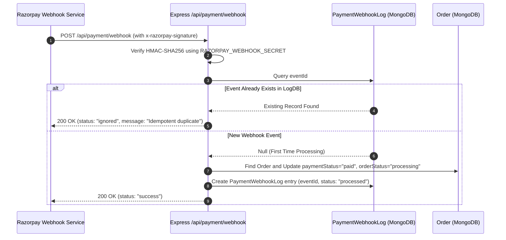

# ShopSphere Backend REST API

[](https://nodejs.org/)
[](https://expressjs.com/)
[](https://www.typescriptlang.org/)
[](https://www.mongodb.com/)
[](https://jwt.io/)
[](https://razorpay.com/)
[](https://cloudinary.com/)

---

## Table of Contents

- [Overview & Architecture](#overview--architecture)
- [Technology Stack Matrix (Why & How)](#technology-stack-matrix-why--how)
- [Directory Structure](#directory-structure)
- [Data Models & Schema Architecture](#data-models--schema-architecture)
- [REST API Specification](#rest-api-specification)
  - [Authentication & Identity](#1-authentication--identity-api)
  - [Product Catalog & Inventory](#2-product-catalog--inventory-api)
  - [Orders & Checkout Processing](#3-orders--checkout-processing-api)
  - [Logistics & Delivery Tracking](#4-logistics--delivery-tracking-api)
  - [Shopping Cart Persistence](#5-shopping-cart-persistence-api)
  - [Coupons & Promotional Engine](#6-coupons--promotional-engine-api)
  - [Customer Product Reviews](#7-customer-product-reviews-api)
  - [Payment Gateways & Webhooks](#8-payment-gateways--webhooks-api)
  - [AI Shopping Assistant](#9-ai-shopping-assistant-api)
  - [System Health Monitoring](#10-system-health-monitoring-api)
- [Security Implementations](#security-implementations)
- [Idempotent Webhook Processing Engine](#idempotent-webhook-processing-engine)
- [Environment Configuration](#environment-configuration)
- [Database Seeding & Test Data](#database-seeding--test-data)
- [Testing & Quality Assurance](#testing--quality-assurance)
- [Local Setup & Scripts](#local-setup--scripts)

---

## Overview & Architecture

The ShopSphere Backend is a modular, event-driven REST API engineered to serve high-concurrency client requests, manage transactional inventory updates, verify cryptographic payment signatures, and maintain end-to-end logistics tracking.

```
+-------------------------------------------------------------------------+
|                        Express 5 Request Pipeline                       |
+-------------------------------------------------------------------------+
                                     |
                                     v
                  +-------------------------------------+
                  |   CORS Middleware & Request Logger  |
                  +-------------------------------------+
                                     |
                                     v
                  +-------------------------------------+
                  |  JSON Parser (with RawBody Buffer)  |
                  +-------------------------------------+
                                     |
                                     v
                  +-------------------------------------+
                  |       Cookie Parser Middleware      |
                  +-------------------------------------+
                                     |
                                     v
                  +-------------------------------------+
                  |      Router Layer (/api Routes)     |
                  +-------------------------------------+
                                     |
                                     v
                  +-------------------------------------+
                  |   Auth Middleware (JWT / RBAC)      |
                  +-------------------------------------+
                                     |
                                     v
                  +-------------------------------------+
                  |         Domain Controllers          |
                  +-------------------------------------+
                                     |
                                     v
                  +-------------------------------------+
                  |         Mongoose Data Models        |
                  +-------------------------------------+
                                     |
                                     v
                  +-------------------------------------+
                  |          MongoDB Database           |
                  +-------------------------------------+
```

---

## Technology Stack Matrix (Why & How)

| Dependency | Purpose | Why We Chose It | How We Used It |
|---|---|---|---|
| `express` (v5.1) | Core Web Framework | Native promise support, unhandled rejection catching, performant routing engine. | Configured server instances, request routers, custom error handlers, and middleware pipelines. |
| `typescript` (v5.8) | Static Type System | Eliminates type coercion issues, enforces data structures, and improves refactoring safety. | Defined strict interfaces for Request extensions (`req.user`), Schema types, and DTO contracts. |
| `mongoose` (v8.16) | Object Document Mapper | Elegant schema validation, population of document references, and pre-save lifecycle middleware. | Structured 6 data models (`User`, `Product`, `Order`, `Cart`, `Coupon`, `PaymentWebhookLog`). |
| `jsonwebtoken` | Token Authentication | Industry standard for stateless, cryptographically signed user sessions. | Signs 7-day tokens stored inside secure `HttpOnly` cookies upon registration and login. |
| `bcryptjs` | Password Hashing | Robust one-way salt-and-hash algorithm resistant to rainbow table lookups. | Applied pre-save hooks on the `User` model to salt and hash passwords with 10 work factor rounds. |
| `google-auth-library` | Google SSO Verification | Direct Google API token validation without bulky third-party identity wrappers. | Verifies Google ID tokens received from the client in the `/api/auth/google` controller. |
| `razorpay` & `crypto` | Payment Gateway & Signature | Official SDK for order creation and native Node crypto for cryptographic checksum verification. | Creates transaction orders in paise, validates client payment signatures, and verifies webhooks via HMAC-SHA256. |
| `cloudinary` & `multer` | Image Upload & CDN Storage | High availability cloud storage with automatic compression, resizing, and global CDN delivery. | Parses multipart form data (`multer.memoryStorage`) and streams image buffers to Cloudinary. |
| `nodemailer` | SMTP Communication | Reliable, zero-dependency SMTP email delivery library. | Sends transactional password reset links containing cryptographically secure random tokens. |
| `dotenv` | Environment Injection | Securely injects configuration flags without hardcoding sensitive secrets. | Reads runtime configurations from `.env` files into `process.env`. |
| `cookie-parser` | Cookie Extraction | Parses standard HTTP Cookie headers into formatted JavaScript objects. | Extracts `token` from `req.cookies` in `auth.middleware.ts` for session validation. |
| `cors` | Cross-Origin Policy | Restricts browser-based API access strictly to trusted frontend origins. | Configured origin whitelist supporting credentials (`credentials: true`) across local and production hosts. |

---

## Directory Structure

```
ShopShereB/
|-- src/
|   |-- controllers/
|   |   |-- admin.controller.ts          # Store analytics, metrics, and user management
|   |   |-- auth.controller.ts           # Registration, login, Google SSO, password reset
|   |   |-- cart.controller.ts           # User cart operations and localStorage sync
|   |   |-- chat.controller.ts           # Groq LLaMA-3 AI assistant and rule fallback
|   |   |-- coupon.controller.ts         # Coupon creation, calculation, and rule validation
|   |   |-- delivery.controller.ts       # Delivery partner portal and checkpoint logging
|   |   |-- health.controller.ts         # System diagnostics, uptime, and DB health
|   |   |-- order.controller.ts          # Order creation, verification, cancellation, admin
|   |   |-- payment.controller.ts        # Razorpay orders, signatures, and idempotent webhooks
|   |   |-- product.controller.ts        # Product catalog search, filter, pagination, CRUD
|   |   `-- review.controller.ts         # Review creation, rating aggregation, deletion
|   |
|   |-- middlewares/
|   |   |-- auth.middleware.ts           # JWT extraction, user injection, RBAC guards
|   |   `-- upload.middleware.ts         # Multer in-memory upload configurations
|   |
|   |-- models/
|   |   |-- cart.model.ts                # Cart schema with product reference and quantity
|   |   |-- coupon.model.ts              # Coupon schema (rules, dates, category limits)
|   |   |-- order.model.ts               # Order schema with nested tracking and audit logs
|   |   |-- paymentWebhookLog.model.ts   # Webhook event idempotency records
|   |   |-- product.model.ts             # Product catalog schema with reviews and ratings
|   |   `-- user.model.ts                # User schema with bcrypt hooks and role definitions
|   |
|   |-- routes/
|   |   |-- admin.routes.ts              # /api/admin endpoints
|   |   |-- auth.routes.ts               # /api/auth endpoints
|   |   |-- cart.routes.ts               # /api/cart endpoints
|   |   |-- chat.routes.ts               # /api/chat endpoints
|   |   |-- coupon.routes.ts             # /api/coupons endpoints
|   |   |-- delivery.routes.ts           # /api/delivery endpoints
|   |   |-- index.routes.ts              # Master route aggregation
|   |   |-- order.routes.ts              # /api/orders endpoints
|   |   |-- payment.routes.ts            # /api/payment endpoints
|   |   |-- product.routes.ts            # /api/products endpoints
|   |   `-- review.routes.ts             # /api/reviews endpoints
|   |
|   |-- tests/
|   |   `-- system_test.ts               # End-to-end integration test runner
|   |
|   |-- utils/
|   |   |-- cache.ts                     # In-memory TTL key-value caching helper
|   |   |-- cloudinary.ts                # Cloudinary SDK client configuration
|   |   |-- jwt.ts                       # Token generation and verification helper
|   |   |-- seeder.ts                    # Database population script with sample data
|   |   `-- sendEmail.ts                 # Nodemailer transport utility
|   |
|   `-- index.ts                         # Server entrypoint, CORS, and DB connection
|
|-- .env.example                         # Environment variables template
|-- package.json                         # Node package configuration
|-- tsconfig.json                        # TypeScript compiler options
`-- README.md                            # Documentation (This file)
```

---

## Data Models & Schema Architecture

```
+-------------------+       +--------------------+       +--------------------+
|       User        |       |      Product       |       |       Coupon       |
+-------------------+       +--------------------+       +--------------------+
| _id               |       | _id                |       | _id                |
| name              |       | name               |       | code (unique)      |
| email (unique)    |       | description        |       | discountType       |
| password (hashed) |       | price              |       | discountValue      |
| role (enum)       |       | originalPrice      |       | minOrderValue      |
| isVerified        |       | category           |       | maxDiscountAmount  |
| resetPasswordToken|       | stock              |       | expiryDate         |
| resetPasswordExpire       | images []          |       | usageLimit         |
+-------------------+       | rating             |       | usedCount          |
          |                 | numReviews         |       | applicableCategory |
          | 1:N             | reviews []         |       +--------------------+
          v                 +--------------------+                 |
+-------------------+                 |                            |
|       Order       |<----------------+                            |
+-------------------+                                              |
| _id               |                                              |
| user (ref: User)  |                                              |
| orderItems []     |                                              |
| shippingAddress   |                                              |
| paymentMethod     |                                              |
| paymentStatus     |                                              |
| orderStatus       |                                              |
| couponApplied     |<---------------------------------------------+
| trackingEvents [] |
| razorpayOrderId   |
| razorpayPaymentId |
+-------------------+
```

---

## REST API Specification

### 1. Authentication & Identity API

| Method | Endpoint | Description | Access |
|---|---|---|---|
| `POST` | `/api/auth/register` | Create a new user account with hashed credentials | Public |
| `POST` | `/api/auth/login` | Authenticate user and issue HTTP-Only JWT cookie | Public |
| `POST` | `/api/auth/google` | Verify Google ID token and provision/login user | Public |
| `POST` | `/api/auth/logout` | Clear user session cookie | Public |
| `GET` | `/api/auth/me` | Fetch currently authenticated user identity | Authenticated |
| `POST` | `/api/auth/forgot-password` | Generate reset token and email password reset link | Public |
| `POST` | `/api/auth/reset-password/:token` | Validate token and set new password | Public |
| `PUT` | `/api/auth/update-password` | Update current password using active session | Authenticated |

#### Sample Request: Register User
```bash
POST /api/auth/register
Content-Type: application/json

{
  "name": "Alex Johnson",
  "email": "alex@example.com",
  "password": "Password123!"
}
```

---

### 2. Product Catalog & Inventory API

| Method | Endpoint | Description | Access |
|---|---|---|---|
| `GET` | `/api/products` | Retrieve catalog with search, filter, and pagination | Public |
| `GET` | `/api/products/all` | Fetch lightweight names list for instant search | Public |
| `GET` | `/api/products/categories` | Fetch all distinct product categories | Public |
| `GET` | `/api/products/:id` | Fetch detailed single product record | Public |
| `GET` | `/api/products/:id/related` | Retrieve related products within same category | Public |
| `GET` | `/api/products/admin` | Unpaginated complete catalog for management | Admin |
| `POST` | `/api/products` | Create product with multipart image uploads | Admin |
| `PUT` | `/api/products/:id` | Update product details and inventory | Admin |
| `DELETE` | `/api/products/:id` | Remove product record from database | Admin |

#### Query Parameters for `/api/products`
- `keyword` *(string)*: Regex search across name, description, and brand.
- `category` *(string)*: Category filter (e.g. `Electronics`, `Fashion`, `Footwear`).
- `minPrice` / `maxPrice` *(number)*: Price range filter boundaries.
- `minRating` *(number)*: Filter by minimum average customer rating (1 to 5).
- `sortBy` *(string)*: Sorting criteria (`price-asc`, `price-desc`, `newest`, `rating`).
- `page` *(number)*: Target pagination page index (default: `1`).
- `limit` *(number)*: Items returned per page (default: `12`).

---

### 3. Orders & Checkout Processing API

| Method | Endpoint | Description | Access |
|---|---|---|---|
| `POST` | `/api/orders` | Initialize order and obtain Razorpay payment parameters | Authenticated |
| `POST` | `/api/orders/demo` | Instant checkout / Cash On Delivery with stock deduction | Authenticated |
| `POST` | `/api/orders/verify` | Verify cryptographic HMAC signature for Razorpay payment | Authenticated |
| `GET` | `/api/orders/mine` | Fetch authenticated customer order history | Authenticated |
| `GET` | `/api/orders/track/:identifier` | Public parcel lookup by Order ID or tracking number | Public |
| `GET` | `/api/orders/:id` | Fetch detailed single order record and invoice data | Authenticated |
| `PUT` | `/api/orders/:id/cancel` | Cancel order before shipment and restore inventory | Authenticated |
| `GET` | `/api/orders` | Retrieve all platform orders | Admin |
| `GET` | `/api/orders/admin/analytics` | Store metrics (Total Revenue, Orders, Growth) | Admin |
| `PUT` | `/api/orders/:id/status` | Update fulfillment state (`processing`, `shipped`, etc.) | Admin |
| `PUT` | `/api/orders/:id/deliver` | Mark order as delivered and complete payment capture | Admin |

---

### 4. Logistics & Delivery Tracking API

| Method | Endpoint | Description | Access |
|---|---|---|---|
| `GET` | `/api/delivery` | Retrieve active dispatch orders for delivery agents | Delivery / Admin |
| `PUT` | `/api/delivery/:id/status` | Append tracking event and update delivery checkpoint | Delivery / Admin |

#### Tracking Status Enum Values
- `in_transit`: Package moving through logistics sorting facilities.
- `out_for_delivery`: Package assigned to courier for final doorstep delivery.
- `delivered`: Successfully received and verified by customer.
- `failed`: Delivery attempt unsuccessful; re-attempt scheduled.

---

### 5. Shopping Cart Persistence API

| Method | Endpoint | Description | Access |
|---|---|---|---|
| `GET` | `/api/cart` | Retrieve persisted cart items for current user | Authenticated |
| `POST` | `/api/cart` | Add product or increment quantity in cloud cart | Authenticated |
| `DELETE` | `/api/cart/:productId` | Remove specific product from user cart | Authenticated |
| `DELETE` | `/api/cart` | Clear entire shopping cart | Authenticated |
| `POST` | `/api/cart/sync` | Merge offline guest cart items into authenticated cart | Authenticated |

---

### 6. Coupons & Promotional Engine API

| Method | Endpoint | Description | Access |
|---|---|---|---|
| `POST` | `/api/coupons/validate` | Verify coupon code against cart total and constraints | Authenticated |
| `GET` | `/api/coupons` | Retrieve active coupons for promotional display | Public / Auth |
| `POST` | `/api/coupons` | Create new promotional coupon rule | Admin |
| `PUT` | `/api/coupons/:id` | Update existing coupon terms or limits | Admin |
| `DELETE` | `/api/coupons/:id` | Deactivate and delete coupon | Admin |

#### Sample Request: Validate Coupon
```bash
POST /api/coupons/validate
Content-Type: application/json

{
  "code": "SHOPSHERE10",
  "orderAmount": 2500,
  "category": "Electronics"
}
```

---

### 7. Customer Product Reviews API

| Method | Endpoint | Description | Access |
|---|---|---|---|
| `POST` | `/api/reviews/:productId` | Submit customer review and star rating (1 to 5) | Authenticated |
| `GET` | `/api/reviews/:productId` | Retrieve customer reviews for a given product | Public |
| `DELETE` | `/api/reviews/:productId/:reviewId`| Remove inappropriate review | Admin |

---

### 8. Payment Gateways & Webhooks API

| Method | Endpoint | Description | Access |
|---|---|---|---|
| `POST` | `/api/payment/create-order` | Generate Razorpay server order | Authenticated |
| `POST` | `/api/payment/verify` | Validate client payment signature | Authenticated |
| `POST` | `/api/payment/webhook` | Idempotent automated payment status webhook handler | Public (HMAC Verified) |

---

### 9. AI Shopping Assistant API

| Method | Endpoint | Description | Access |
|---|---|---|---|
| `POST` | `/api/chat` | Natural language shopping query and store guidance | Public |

#### Sample Request: Chat Assistant
```bash
POST /api/chat
Content-Type: application/json

{
  "message": "Do you have noise cancelling wireless headphones in stock?"
}
```

---

### 10. System Health Monitoring API

| Method | Endpoint | Description | Access |
|---|---|---|---|
| `GET` | `/health` | Core server status and database connectivity check | Public |
| `GET` | `/api/health` | Diagnostic metrics (uptime, memory usage, timestamp) | Public |

---

## Security Implementations

```
+-------------------------------------------------------------------------+
|                        Security Architecture Summary                    |
+-------------------------------------------------------------------------+
| 1. HTTP-Only Cookie Tokens  | Prevents client script access to JWTs.    |
| 2. SameSite=Lax Policy      | Mitigates Cross-Site Request Forgery.     |
| 3. HMAC-SHA256 Signatures   | Authenticates Razorpay webhook payloads.  |
| 4. Role-Based Access Control| Restricts protected routes by user role.  |
| 5. Bcrypt Password Hashing  | 10 salt rounds prevent plaintext storage. |
| 6. Raw Body Stream Capture  | Preserves raw buffer for signature check. |
| 7. Input Parameter Casting  | Thwarts NoSQL injection operators.       |
+-------------------------------------------------------------------------+
```

---

## Idempotent Webhook Processing Engine

To eliminate race conditions and avoid duplicate order confirmations when external webhooks retry, `ShopShereB` implements an **Idempotency Guard Pattern**:



---

## Environment Configuration

Create a `.env` file in the `ShopShereB` root:

```env
# Server Configuration
PORT=5000
NODE_ENV=development
CLIENT_URL=http://localhost:5173

# Database Connection
MONGODB_URI=mongodb://127.0.0.1:27017/shopshere

# Authentication Secret
JWT_SECRET=super_secure_jwt_secret_shopshere_production_key_2026

# Cloudinary Media Storage (Optional for local development)
CLOUDINARY_CLOUD_NAME=your_cloud_name
CLOUDINARY_API_KEY=your_api_key
CLOUDINARY_API_SECRET=your_api_secret

# Razorpay Payment Gateway (Optional: Mock fallback enabled when omitted)
RAZORPAY_KEY_ID=your_razorpay_key_id
RAZORPAY_KEY_SECRET=your_razorpay_key_secret
RAZORPAY_WEBHOOK_SECRET=your_razorpay_webhook_secret

# Groq AI Service (Optional: Rule-based fallback active when omitted)
GROQ_API_KEY=your_groq_api_key

# Nodemailer SMTP Configuration (Optional for password recovery)
SMTP_HOST=smtp.mailtrap.io
SMTP_PORT=2525
SMTP_USER=your_smtp_username
SMTP_PASS=your_smtp_password
```

---

## Database Seeding & Test Data

The backend includes a comprehensive seeder script that wipes existing demo records and provisions production-like test fixtures:

```bash
npm run seed
```

### Pre-Configured Accounts
- **Admin**: `admin@shopshere.com` | `Admin@12345`
- **Delivery Partner**: `delivery@shopshere.com` | `Delivery@12345`
- **Customer**: `user@shopshere.com` | `User@12345`

### Pre-Configured Discount Coupons
- `SHOPSHERE10`: 10% discount on orders above 500 INR.
- `FLAT500`: 500 INR flat discount on orders above 2000 INR.
- `FREESHIP`: 100% discount on delivery fees.

---

## Testing & Quality Assurance

To execute automated end-to-end integration and system tests verifying API contracts, database operations, and authentication flows:

```bash
npx ts-node src/tests/system_test.ts
```

---

## Local Setup & Scripts

```bash
# 1. Install Node modules
npm install

# 2. Run Database Seeder
npm run seed

# 3. Start Development Server with Auto-Reload
npm run dev

# 4. Compile TypeScript for Production
npm run build

# 5. Start Production Server
npm run start
```
